# Post matlab stuff


```r
source("LoadLibs.R")
```

```
## 
## Attaching package: 'dplyr'
```

```
## The following objects are masked from 'package:plyr':
## 
##     arrange, count, desc, failwith, id, mutate, rename, summarise,
##     summarize
```

```
## The following objects are masked from 'package:stats':
## 
##     filter, lag
```

```
## The following objects are masked from 'package:base':
## 
##     intersect, setdiff, setequal, union
```

```
## 
## Attaching package: 'tidyr'
```

```
## The following object is masked from 'package:reshape2':
## 
##     smiths
```

```r
source("LoadProcessZ1New.R")
attach(knew.molten)

# Merge more details
freeze_details = read.csv("freeze_details.csv")
group_details = read.csv("group_details.csv", header=T, encoding = "UTF-8-BOM")
names(group_details)[1] = "GROUP"

knew.molten2 = merge(knew.molten, freeze_details, by="ID")
knew.molten2 = merge(knew.molten2, group_details, by="GROUP")

knew.molten2 = knew.molten2 %>% mutate(value = ifelse(value=='NaN', 0, value))
```


# TOTAL brain, weighted average by ROI

## Point-range graphs for each of the threshold levels
From the rest of the graphs, we ended up choosing the total cells. 

```r
for (bright in c('low', 'mid', 'hi', 'total')) {
  print(
    knew.molten2 %>%
      filter(UNITS == "density") %>%
      filter(BRIGHTNESS == bright) %>%
      group_by(ID, GROUP, EXPT, CHANNEL, variable) %>%
      summarize(weighted = weighted.mean(value, Pop_roiAreaMM2)) %>%
      ggplot() + aes(GROUP, weighted, color=EXPT) + 
      stat_summary(fun.y = "mean", geom="point") + 
      stat_summary(fun.data = "mean_se", geom="errorbar", aes(width=0.3)) + 
      facet_wrap(~CHANNEL, scales="free") +
      ggtitle(paste(c("Whole brain, weighted, density"),bright,"cells")) +
      theme_minimal() 
  )
}
```

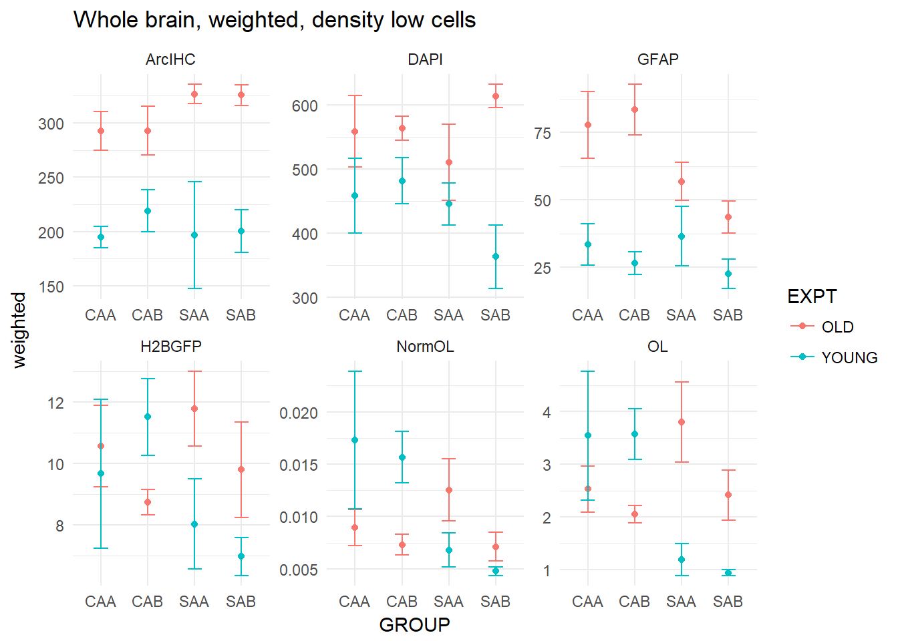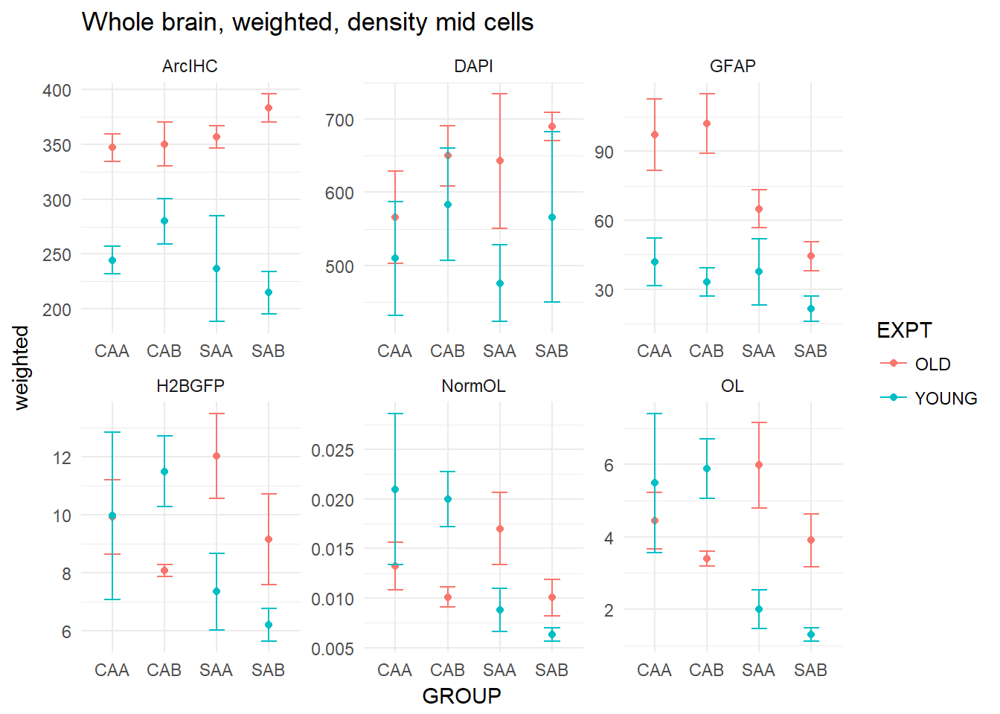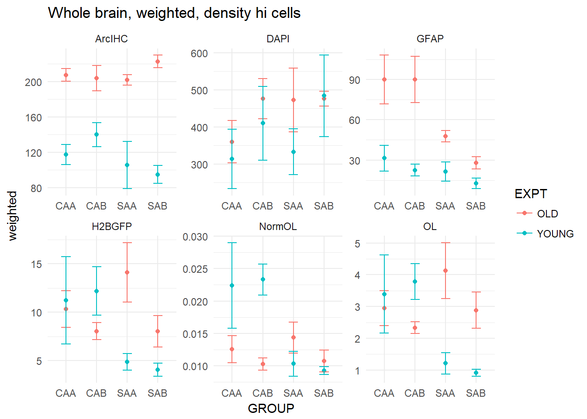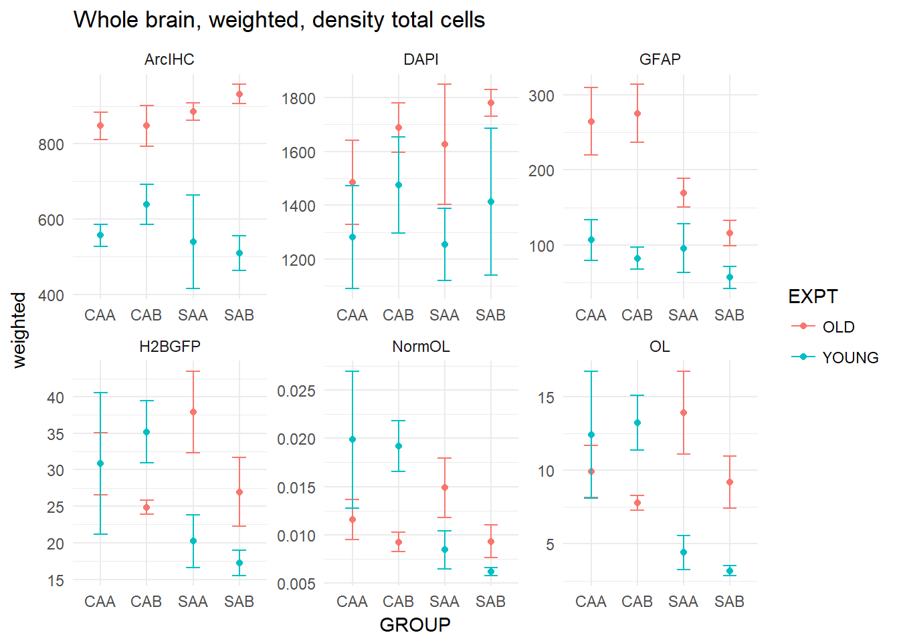


## ANOVA


```r
knew.molten3 = knew.molten2 %>%
  filter(UNITS == "density") %>%
  filter(BRIGHTNESS == 'total')

tot.stats = knew.molten3 %>%
  group_by(CHANNEL) %>%
  do(tidy(aov(data=.,value ~ EXPT * VALENCE * CONTEXT)))


for (ch in unique(tot.stats$CHANNEL)) {
  print(
    tot.stats %>%
      filter(CHANNEL==ch) %>%
      filter(!(term=='Residuals')) %>%
      ggplot() + aes(reorder(CHANNEL, p.value), -log10(p.value), label=p.value, fill=CHANNEL) +
      geom_bar(stat="identity") +
      coord_flip() + theme_minimal() + rx +
      ggtitle(paste(ch, ",", "(3-way ANOVA)")) +
      ylab("p-value 10^-x") +
      xlab("System") +
      facet_wrap(~term, ncol=1) +
      geom_hline(yintercept = 2)
  )
}
```

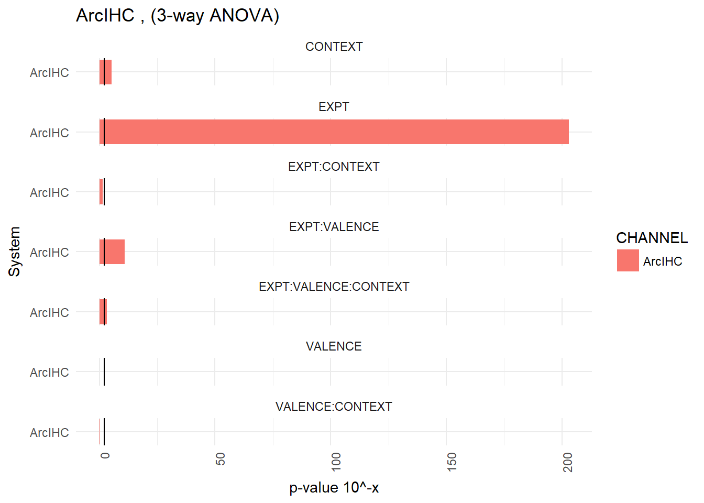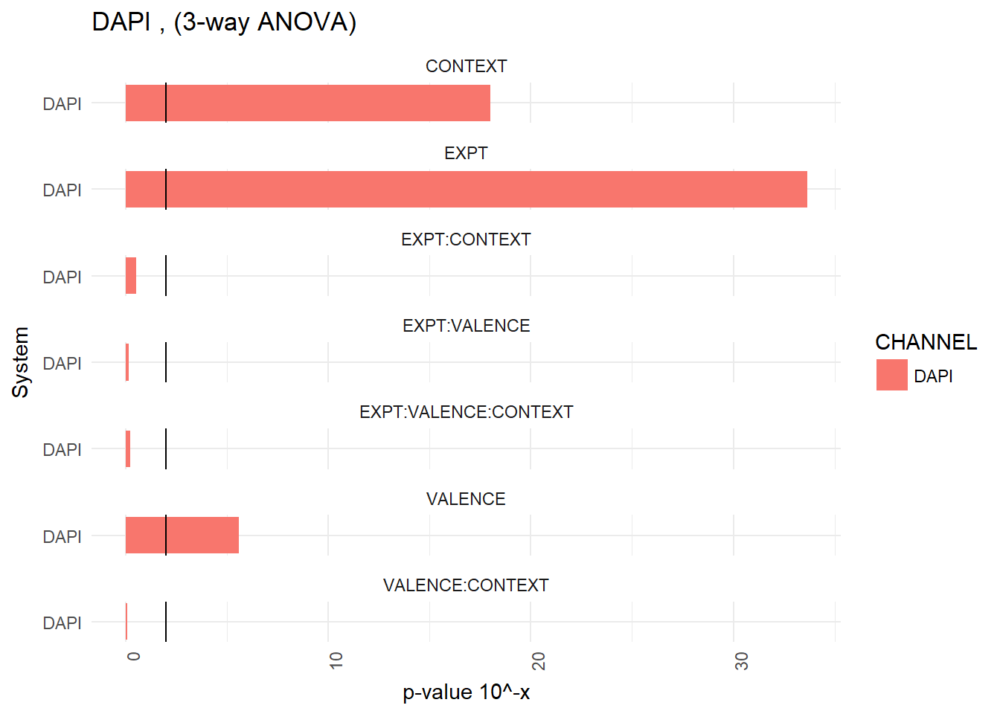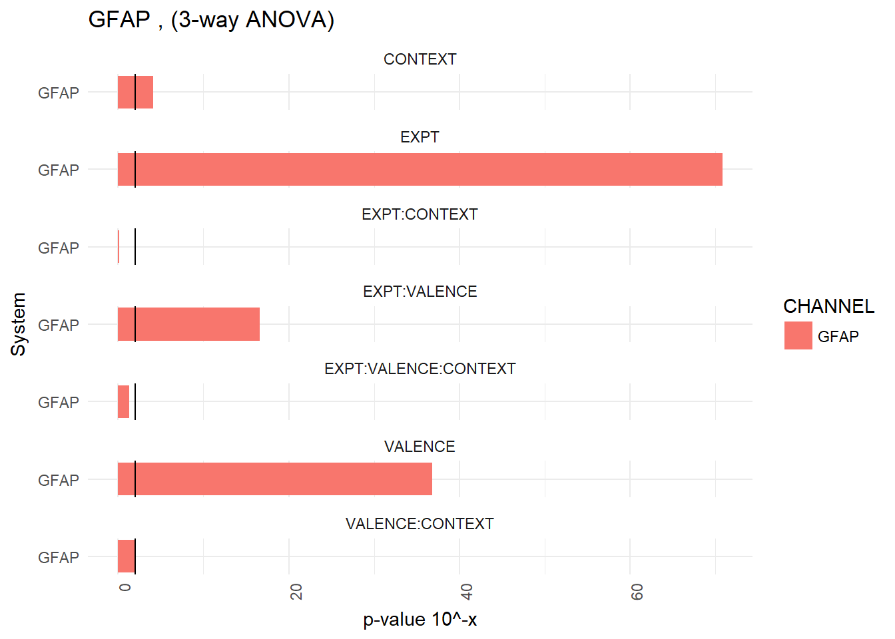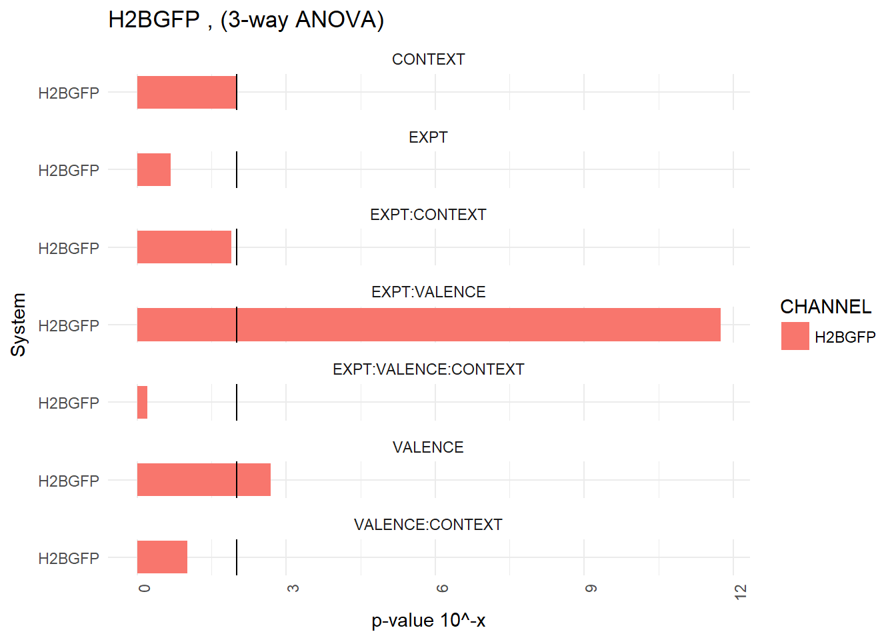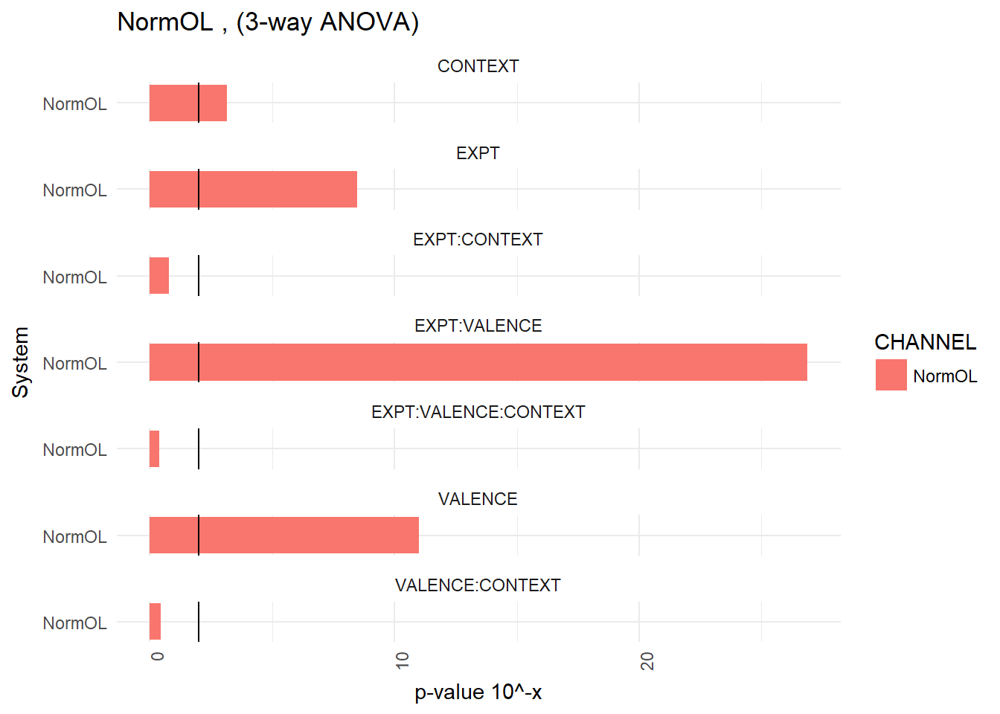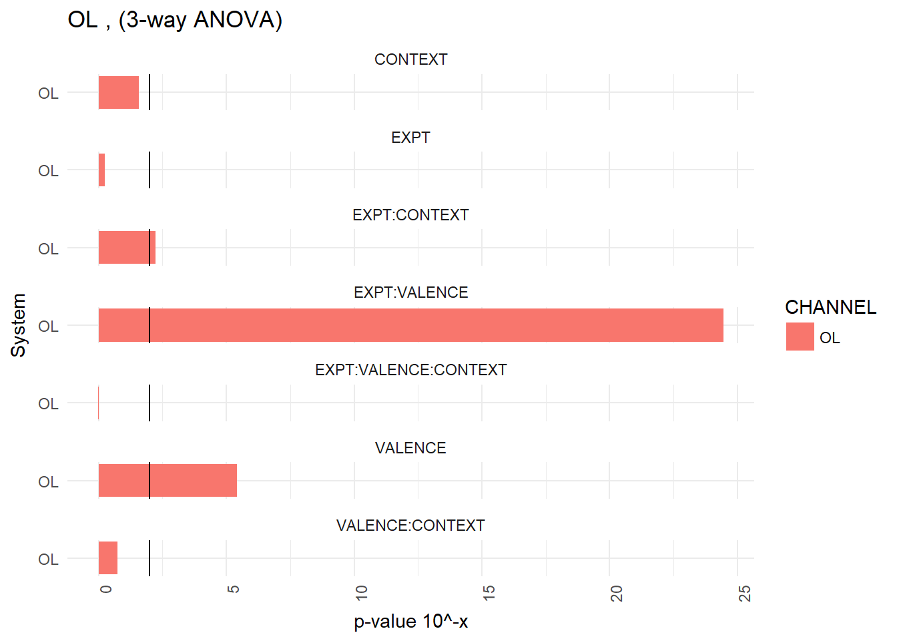


## Linear regressions (total brain)

```r
# shock lin reg
knew.molten2 %>%
  filter(UNITS == "density") %>%
  filter(BRIGHTNESS == 'total') %>%
  filter(VALENCE == 'SHOCK') %>%
  group_by(ID, FREEZE,GROUP, EXPT, CHANNEL, variable) %>%
  summarize(weighted = weighted.mean(value, Pop_roiAreaMM2)) %>%
  ggplot() + aes(FREEZE, weighted) + 
  stat_summary(fun.y="mean", geom="point") +
  facet_wrap(EXPT~CHANNEL, scales="free", ncol=6) + geom_smooth(method="lm") +
  ggtitle("Total brain density vs freezing, total cells, shock animals only") +
  theme_minimal()
```

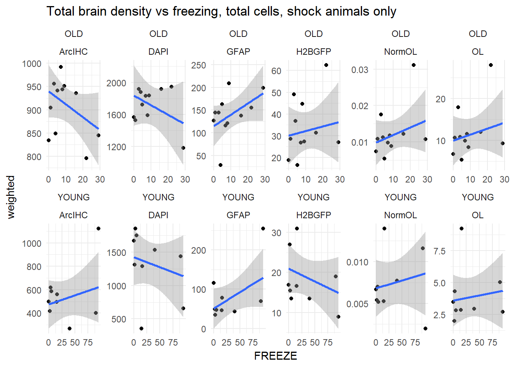

```r
# all animals lin reg
knew.molten2 %>%
  filter(UNITS == "density") %>%
  filter(BRIGHTNESS == 'total') %>%
  group_by(ID, FREEZE,GROUP, EXPT, CHANNEL, variable) %>%
  summarize(weighted = weighted.mean(value, Pop_roiAreaMM2)) %>%
  ggplot() + aes(FREEZE, weighted) + 
  stat_summary(fun.y="mean", geom="point") +
  facet_wrap(EXPT~CHANNEL, scales="free", ncol=6) + geom_smooth(method="lm") +
  ggtitle("Total brain density vs freezing, total cells, ALL animals") +
  theme_minimal()
```

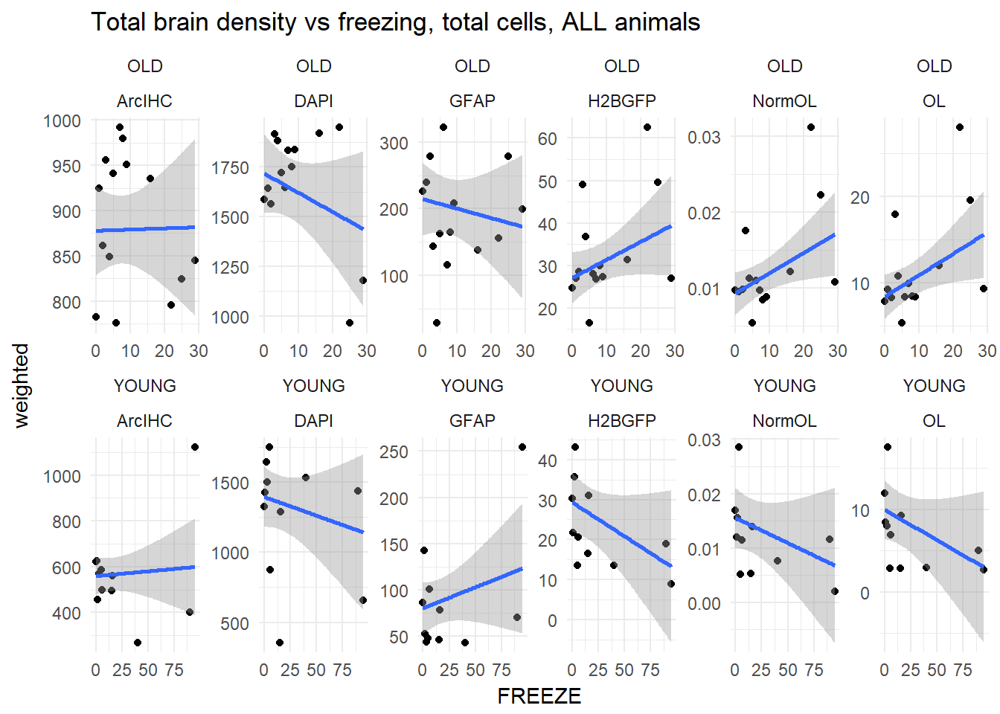
## Stats for linear regressions

```r
 # GET THE STATS
tot.lr = knew.molten2 %>%
  filter(UNITS == "density") %>%
  filter(BRIGHTNESS == 'total') %>%
  filter(VALENCE == 'SHOCK') %>%
  # filter(!(EXPT =='YOUNG' & CONTEXT=='AA' & VALENCE == 'SHOCK' & FREEZE < 30)) %>% # removes young bad freezers
  
  group_by(CHANNEL, EXPT, GROUP, ID, FREEZE) %>%
  summarize(weighted = weighted.mean(value, Pop_roiAreaMM2)) %>%
  
  group_by(CHANNEL, EXPT) %>%
  do(tidy(lm(data=., formula = weighted ~ FREEZE))) %>%
  filter(!term=="(Intercept)") %>%
  mutate(p.value = p.adjust(p.value, method="BH", n=6)) %>%
  mutate(sig = 
           case_when(
             p.value < 0.0005 ~ "***",
             p.value < 0.005 ~ "**", 
             p.value < 0.05 ~ "*"
           ))


# positive or negative
tot.lr %>%
  filter(CHANNEL %in% c("H2BGFP","NormOL", "ArcIHC")) %>% # omit DAPI/OL/GFAP channels for clarity
  # dcast(., CHANNEL+EXPT ~ System, value.var="sig") %>%
  ggplot() + aes(EXPT, CHANNEL, fill=estimate/abs(estimate), label=round(estimate,0)) + geom_tile() +
  scale_fill_continuous(limits=c(-1,1), low="red", high="green", na.value="white") + 
  ggtitle("Slopes from linear regression (red is negative)") +
  theme_light()
```

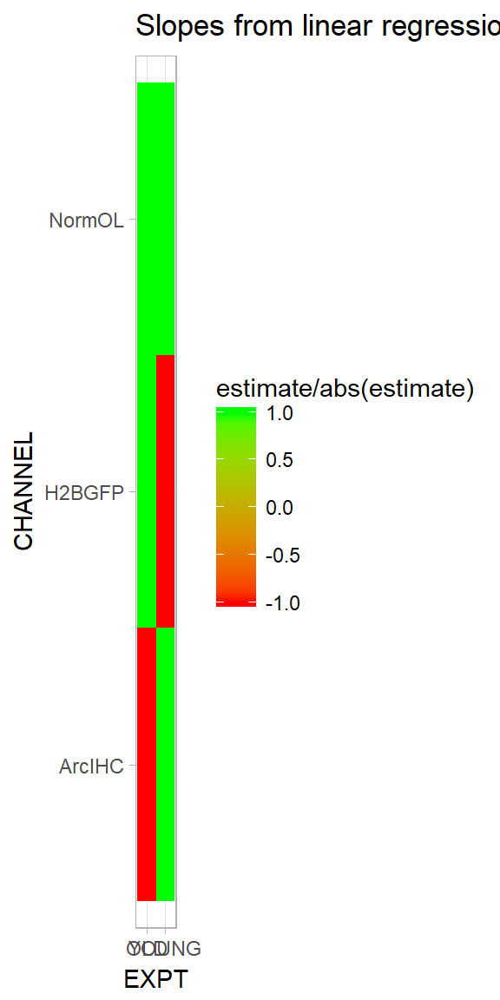

```r
# P VALUES
tot.lr %>%
  filter(CHANNEL %in% c("H2BGFP","NormOL", "ArcIHC")) %>% # omit DAPI/OL/GFAP channels for clarity
  # dcast(., CHANNEL+EXPT ~ System, value.var="sig") %>%
  ggplot() + aes(EXPT, CHANNEL, fill=p.value, label=sig) + geom_tile() +
  scale_fill_continuous(limits=c(0,0.05), low="dark red", high="white", na.value="white") + 
  ggtitle("Signifiance scores from linear regression (Holm corrected)") +
  theme_light() + geom_label(label.size=0, color="white")
```

```
## Warning: Removed 6 rows containing missing values (geom_label).
```

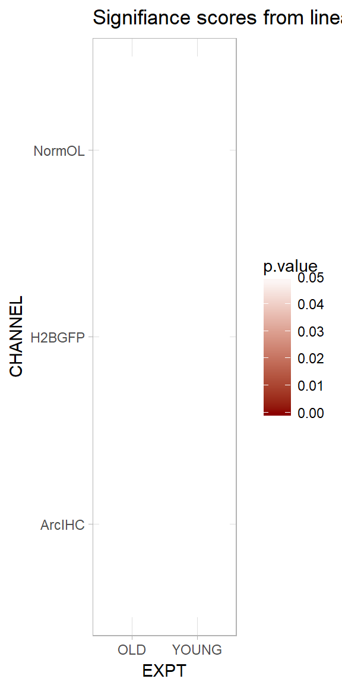


# SYSTEMS analysis 

## Check normality


```r
paratest = sample_n(knew.molten2, 5000)

#check for each group
knew.molten2 %>%
  filter(UNITS == 'density') %>%
  filter(BRIGHTNESS == 'total') %>%
  group_by(System, CHANNEL) %>%
  do(tidy(shapiro.test(.$value)))
```

```
## # A tibble: 96 x 5
## # Groups:   System, CHANNEL [96]
##    System      CHANNEL statistic  p.value method                     
##    <fct>       <fct>       <dbl>    <dbl> <fct>                      
##  1 AUD CTX     ArcIHC      0.935 3.64e- 6 Shapiro-Wilk normality test
##  2 AUD CTX     DAPI        0.961 4.24e- 4 Shapiro-Wilk normality test
##  3 AUD CTX     GFAP        0.881 2.59e- 9 Shapiro-Wilk normality test
##  4 AUD CTX     H2BGFP      0.741 1.40e-14 Shapiro-Wilk normality test
##  5 AUD CTX     NormOL      0.800 1.10e-12 Shapiro-Wilk normality test
##  6 AUD CTX     OL          0.752 3.01e-14 Shapiro-Wilk normality test
##  7 CORTICO-AMY ArcIHC      0.990 4.26e- 1 Shapiro-Wilk normality test
##  8 CORTICO-AMY DAPI        0.967 1.91e- 3 Shapiro-Wilk normality test
##  9 CORTICO-AMY GFAP        0.748 4.19e-14 Shapiro-Wilk normality test
## 10 CORTICO-AMY H2BGFP      0.554 1.03e-18 Shapiro-Wilk normality test
## # ... with 86 more rows
```

## Calculate weighted means for each system

```r
# systems, weighted by ROI area
knew.molten2 %>%
  filter(CHANNEL %in% channel.list[c(2,3,6)]) %>%
  filter(UNITS == "density" & BRIGHTNESS == 'total') %>%
  filter(!(EXPT =='YOUNG' & CONTEXT=='AA' & VALENCE == 'SHOCK' & FREEZE < 30)) %>% # removes young bad freezers
  group_by(ID, System, GROUP, EXPT, CHANNEL, variable) %>%
  summarize(weighted = weighted.mean(value, Pop_roiAreaMM2)) %>%
  ggplot() + aes(GROUP, weighted, color=EXPT) + 
  stat_summary(fun.y = "mean", geom="point") + 
  stat_summary(fun.data = "mean_se", geom="errorbar", aes(width=0.2)) + 
  facet_wrap(CHANNEL~System, scales="free", ncol=15) + 
  ggtitle("systems, weighted, density total cells, bad freezers removed") + 
  theme_light() + rx
```

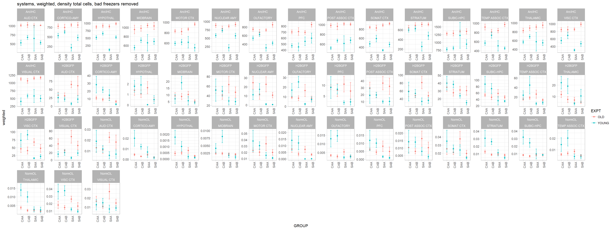

```r
# systems, weighted by ROI area
knew.molten2 %>%
  filter(CHANNEL %in% channel.list[c(2,3,6)]) %>%
  filter(UNITS == "density" & BRIGHTNESS == 'total') %>%
  # filter(!(EXPT =='YOUNG' & CONTEXT=='AA' & VALENCE == 'SHOCK' & FREEZE < 30)) %>% # removes young bad freezers
  group_by(ID, System, GROUP, EXPT, CHANNEL, variable) %>%
  summarize(weighted = weighted.mean(value, Pop_roiAreaMM2)) %>%
  ggplot() + aes(GROUP, weighted, color=EXPT) + 
  stat_summary(fun.y = "mean", geom="point") + 
  stat_summary(fun.data = "mean_se", geom="errorbar", aes(width=0.2)) + 
  facet_wrap(CHANNEL~System, scales="free", ncol=15) + 
  ggtitle("systems, weighted, density total cells, bad freezers NOT removed") + 
  theme_light() + rx
```

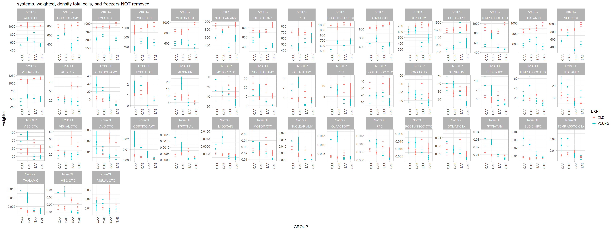

## ANOVA - Systems


